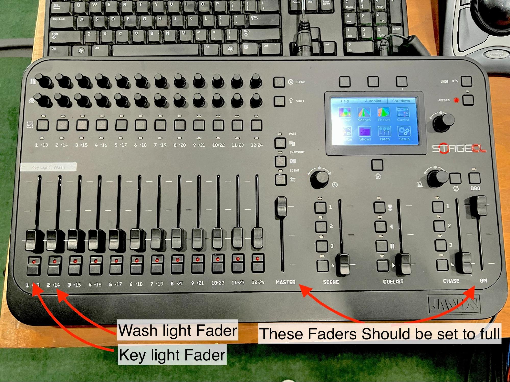
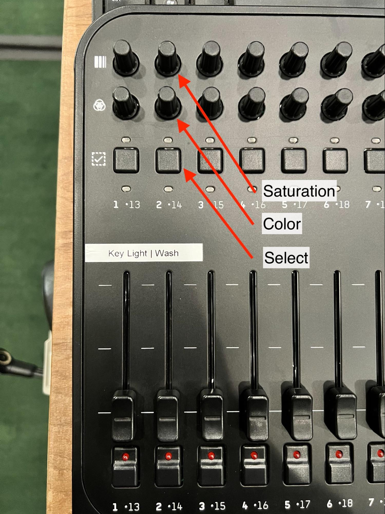
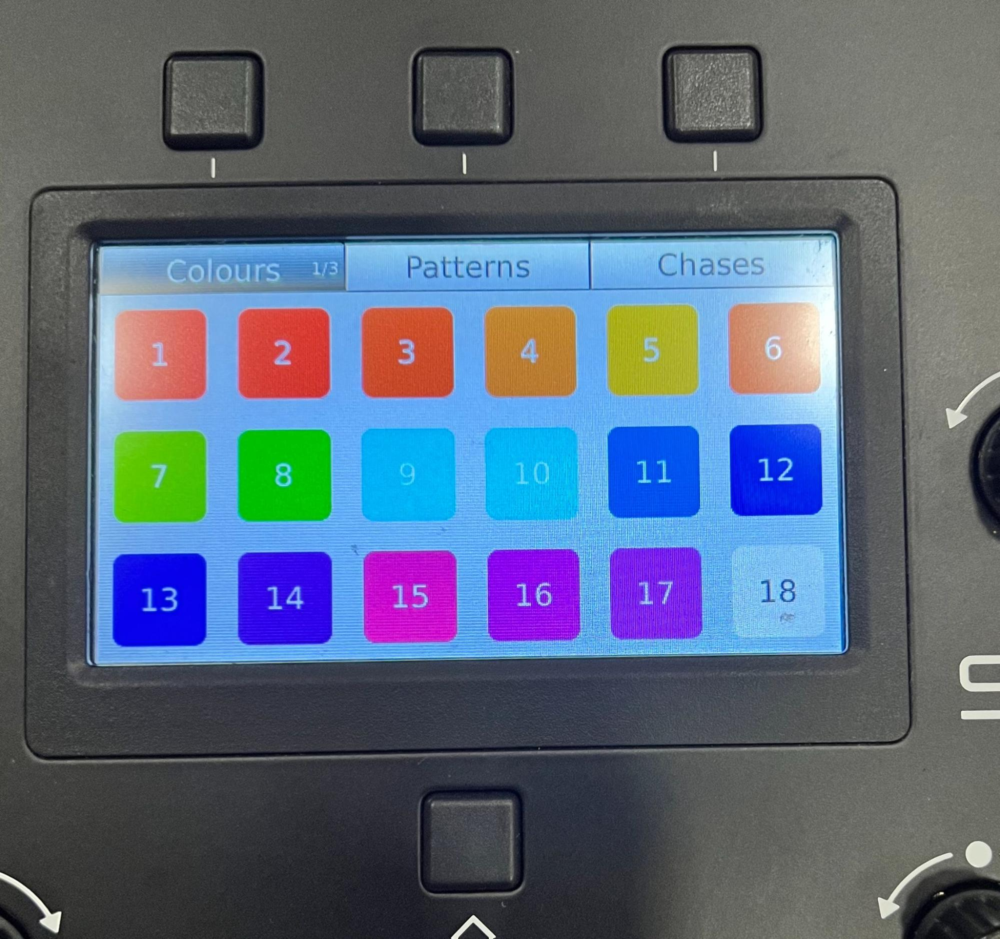
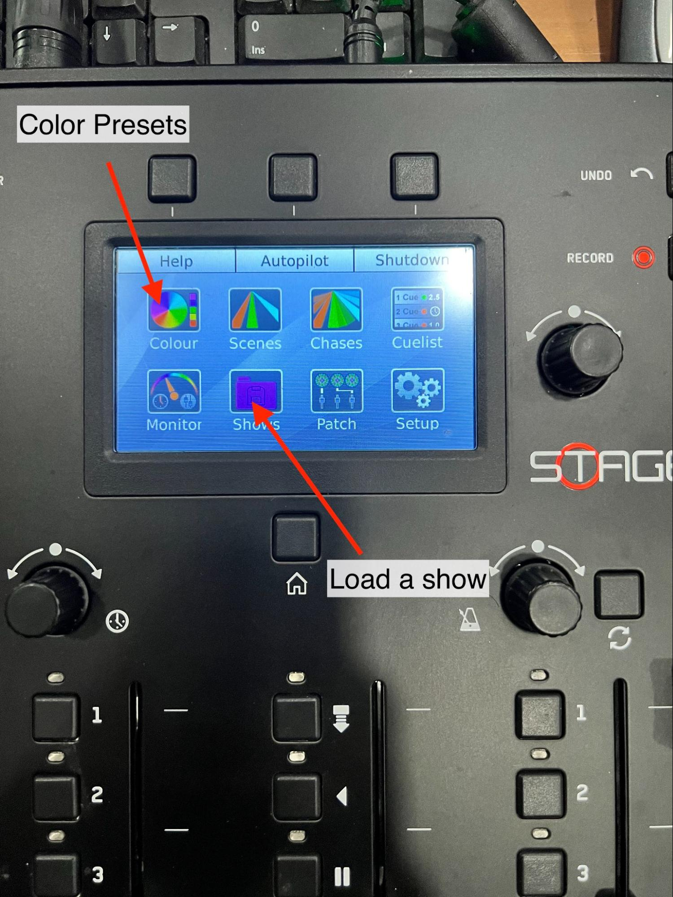
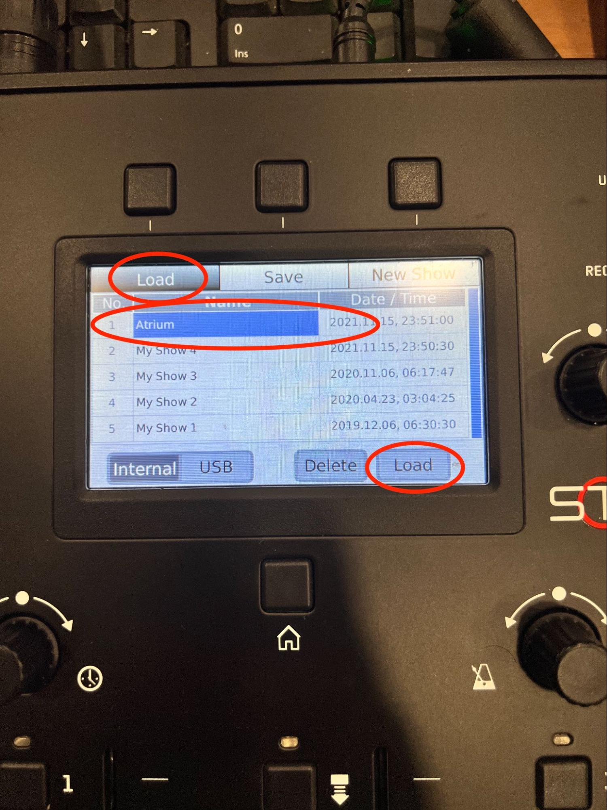

# Atrium Jands Stage CL

This page explains the basic layout of the Atrium Jands Stage CL console, how to change wash light color, and how to reload the Atrium show file if the console is not behaving as expected.

---

## Console Overview

The Stage CL is a fairly basic console with added color selection capabilities.

As with any lighting console, make sure the `GM` and `Master` faders are set to full before setting intensity for individual channels.

For simplicity:

- all key lights are patched to `Channel 1`
- all wash lights are patched to `Channel 2`

---

## Changing the Wash Light Color

You can change the wash lights in two ways.

### Option 1: Use Channel 2 Controls

- Use the `Color` knob on `Channel 2` to cycle through the color options.
- Use the `Saturation` knob to change the color saturation.

### Option 2: Use the Color Preset Menu

- Press the `Select` button on `Channel 2`.
- Go to the `Colour` preset menu.
- Select the color you want.

---

## Loading the Atrium Show

If the console is not functioning the way you expect, load the Atrium show file.

1. From the touchscreen, select `Shows`.
2. Choose the `Atrium` show file.
3. Select `Load`.

