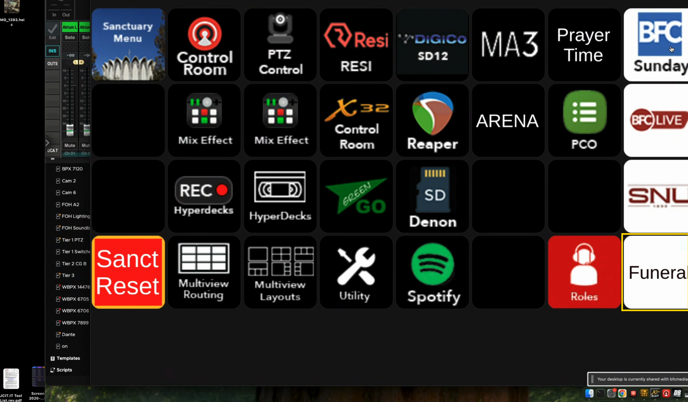
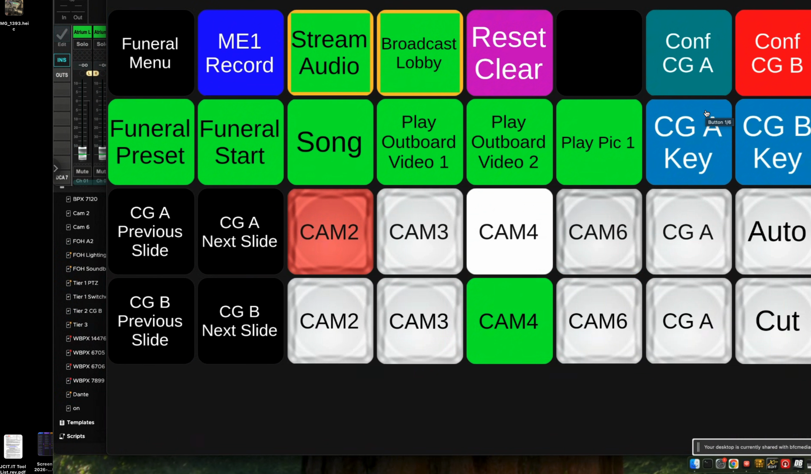

# Control Room Funeral SOP

## Purpose

Run a funeral from the BFC control room — graphics, switching, confidence screens, stream, and recording — using the Companion **Funeral** page. Almost everything is automated behind buttons on that page, so a single operator can run the whole service from any Stream Deck.

## Scope

Sanctuary funerals streamed via RESI and Church Online. The Funeral page is designed for **one-person operation**: the switcher, both graphics computers (CG A / CG B), the confidence screens, and slide advance are all controllable from the page without sitting at the ATEM.

---

## Procedure

### 1. Open the Funeral page

From the Stream Deck main menu, press the red **Funeral** button (bottom-right).

That opens the Funeral page. The top-left **Funeral Menu** button just labels the page — pressing it returns you to the main menu.

### 2. ProPresenter prep

There is a **funeral presentation in ProPresenter that we recycle for every funeral** — start there. This step is ProPresenter only.

- **Update the title slide.** The presentation includes the `funeral title` slide — the title card with the deceased's name (e.g., "John Doe Funeral Service"). If the name is wrong, edit the text on that slide so it reads correctly.
- **Import and label any media.** If the family provided a video, import it to ProPresenter and apply the existing label `funeral video 1` (right-click → Labels → `funeral video 1`); a second video gets `funeral video 2`; a picture is labeled for `Play Pic`. These labels are how the Companion macros find and fire the media — the `Play Outboard Video` / `Play Pic` buttons run multi-action macros that trigger whatever ProPresenter item carries that label.

### 3. Confirm the stream

- Go to `control.resi.io` and confirm the funeral is scheduled.
- Go to `bethanynaz.church.online` and confirm the stream is scheduled.
- Monitor both RESI and Church Online throughout the funeral to make sure the stream stays up.

### 4. Audio sound check

Do a quick sound check with the sound engineer to confirm they are receiving any audio coming from the control room.

### 5. Press Funeral Preset (preshow state)

Press **Funeral Preset**. One press sets the whole room to the pre-service look:

- Brings up the title slide and sets the correct stage-display layout for CG A on the rear confidence screens.
- Sets all switcher routing for the funeral — outboards, lobby, stream, and confidence screens.
- Arms stream audio and broadcast-to-lobby audio.

You should now see the title slide on the rear screens, with graphics and audio armed. **Be at this stage before the stream goes live.** Hold here until the service is ready to begin.

### 6. Press Funeral Start (go live)

Press **Funeral Start** when the service begins. This takes Camera 4 (wide) live and starts recording (HyperDeck + ME record). The service is now live to cameras and recording.

### 7. Run the service

- **Cut cameras** from the mini-switcher at the bottom of the page: pick a source on the preview row, then `Auto` or `Cut`. This works from any Stream Deck without sitting at the switcher.
- **For a song that needs lyrics** (on the program/stream or the confidence screens), press **Song**: rear screens switch to CG B (lyrics), the lyrics keyer comes on, and the lyrics get the correct funeral look. Press **Song** again when the song ends to return to CG A.
- **To play a video**, press **Play Outboard Video 1** (or `2`): it clears CG A, forces the rear screens to CG A's service layout, takes the graphics bus, and plays the ProPresenter item labeled `funeral video 1`. Press again to reverse it.
- **To show a picture**, press **Play Pic 1**.
- **To advance slides** remotely, use the `CG A` / `CG B` Previous and Next Slide buttons.

### 8. End of service / teardown

- Leave the title slide in program until the family has exited the room.
- Then turn the projectors off.
- Change the campus feed back to the regular kiosk slides.
- Stop the stream cleanly. (Trim/archive the recording on RESI and YouTube afterward.)

---

## Button Reference

The Funeral page, button by button.

| Button | What it does |
| --- | --- |
| **Funeral Menu** | Page label. Press to return to the main menu. |
| **ME1 Record** | Toggles recording on ME1 / HyperDeck. |
| **Stream Audio** | Sets the X32 to the correct mode and turns stream audio on. |
| **Broadcast Lobby** | Sets the X32 to send audio to the lobby. |
| **Reset Clear** | Resets/clears the funeral routing and graphics. |
| **Conf CG A / Conf CG B** | Manually send the rear confidence screens to CG A (graphics) or CG B (lyrics). |
| **Funeral Preset** | Preshow setup — fires the ProPresenter funeral presentation and title slide, sets the CG A stage-display layout, and routes the switcher for outboards, lobby, stream, and confidence screens; arms stream and lobby audio. |
| **Funeral Start** | Camera 4 (wide) live and starts recording (HyperDeck + ME record). |
| **Song** | Press 1: rear screens → CG B lyrics, lyrics keyer on, funeral look applied. Press 2: back to CG A, lyrics keyer off. |
| **Play Outboard Video 1 / 2** | Clears CG A, sets the CG A service layout, takes the graphics bus, and plays the ProPresenter item labeled `funeral video 1` / `funeral video 2`. Press again to reverse. |
| **Play Pic 1** | Same as the video buttons, for a still picture. |
| **CG A Key / CG B Key** | Manually toggle the CG A / CG B keyers. |
| **CG A / CG B Previous + Next Slide** | Advance slides on the CG A / CG B ProPresenter computers remotely. |
| **Mini-switcher (CAM2 / CAM3 / CAM4 / CAM6 / CG A, Auto, Cut)** | Limited program/preview switcher. Top CAM row = preview bus, bottom = program bus (CAM4 = wide). `Auto` dissolves, `Cut` hard-cuts. |

---

## Notes

- The Funeral page is built for single-operator funerals — every needed control is reachable from any Stream Deck.
- Video and picture playback rely on the ProPresenter labels `funeral video 1`, `funeral video 2`, and the picture label. If a button does nothing, check that the media in ProPresenter carries the correct label.
- *To confirm: exact switcher output numbers used by Funeral Preset, and standard funeral camera positions and how they map to CAM2/3/4/6.*

## End State

When the service is over: the title slide stayed up until the family left, projectors are off, the campus feed is back on kiosk slides, the stream is stopped, and the recording is ready to be trimmed and archived.
