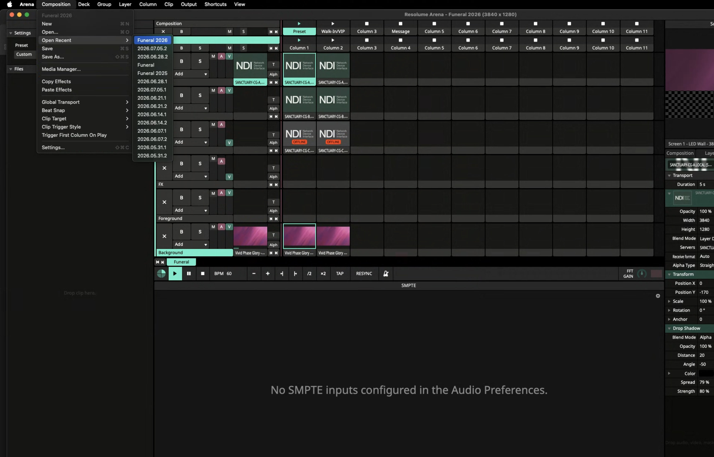
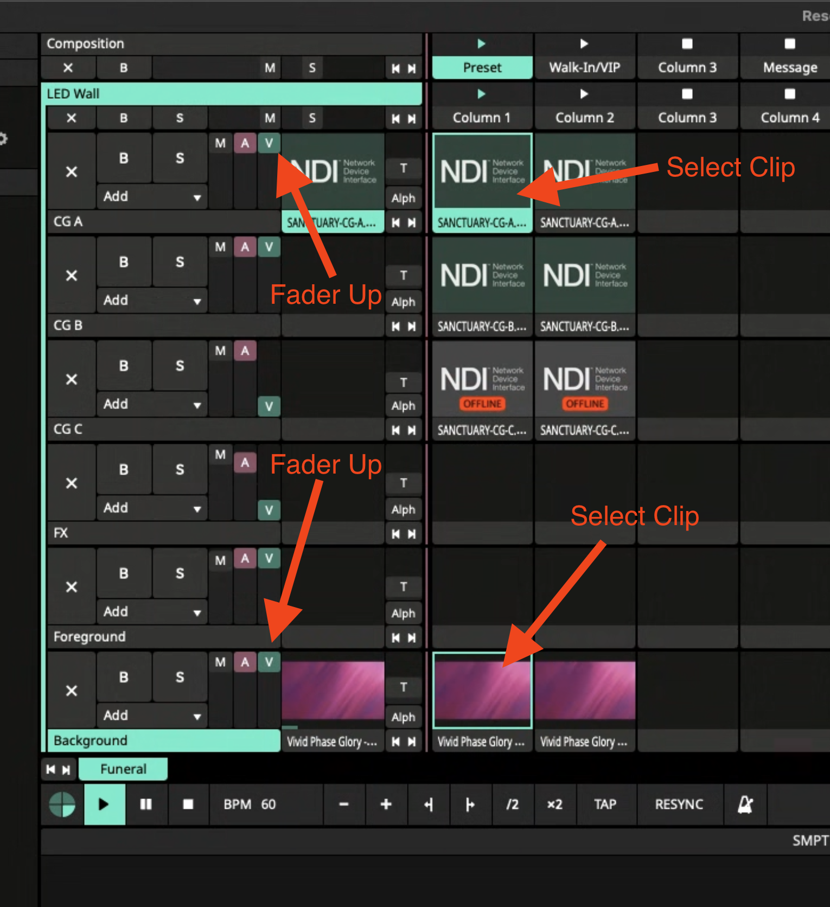
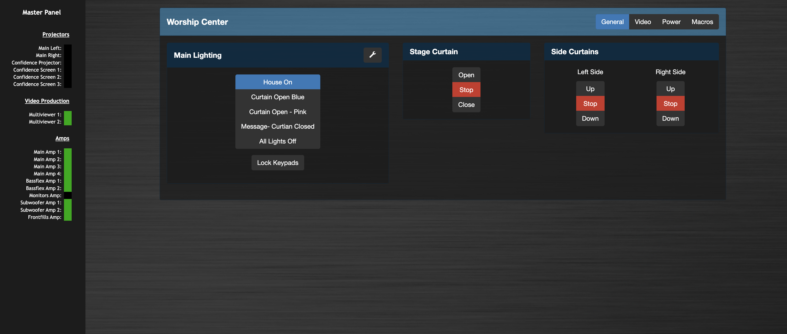
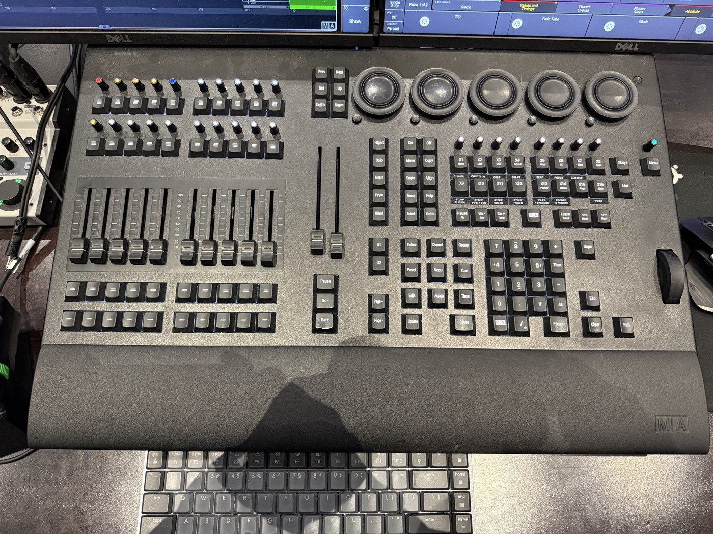
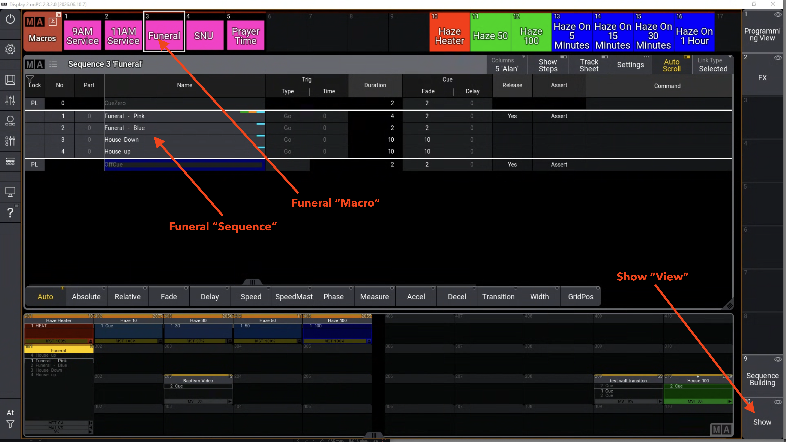

# Lights & LED Wall — Funeral Prep SOP

## Purpose

Get the Sanctuary **lighting** and the **LED wall graphics** into their funeral state. For a funeral the lights are **static** — one color look that stays up the whole service — but getting there is not obvious. It involves opening the right composition in Resolume Arena, releasing the house-lighting controller and opening the curtains, and firing a macro on the grandMA3 console. This page walks a non-lighting operator through all three, in order.

## Scope

Sanctuary funerals, set up from the **front-of-house (FOH) position** — the Resolume Arena computer, ControlFlex, and the grandMA3 console all live there. The lighting is **static** for a funeral: once it's set, there is nothing to operate during the service, so this is purely prep.

This page does **not** cover the control-room video/switching/stream side — that lives in the [Control Room Funeral SOP](../control-room-funeral-sop/), which is also where the **photo and scripture** on the LED wall are actually driven. The normal flow is to do this FOH setup first, then head up to the control room and follow that SOP.

> **Assumes the booth and stage equipment is already powered on** (it normally stays on). Powering the room up from cold is a separate process.

---

## Procedure

### 1. Resolume Arena — open the funeral composition

The computer **to the right of the lighting console** runs Resolume Arena and drives the **LED wall**. On the computer's dock, look for the large green **A** icon.

- Open **Arena**.
- Menu bar → **Composition → Open Recent → `Funeral 2026`**.
- When it asks whether to save the composition that's currently open, choose **Save and Open**.

The funeral composition has **two columns that are identical except for color** — Column 1 is **Pink**, Column 2 is **Blue**. For a standard funeral, use **Column 1 (Pink)**.

Set up the **two layers that matter — CG A and Background** (the bottom layer). For each one, do both things shown in the screenshot below:

- **Select Clip** — click its clip in **Column 1** so it's outlined: the `SANCTUARY-CG-A` NDI clip on **CG A**, and the `Vivid Phase Glory` clip on **Background**.
- **Fader Up** — make sure that layer's green **V** (video) fader is up.

Leave **CG B, CG C, FX, and Foreground** as they are.

**Fire these clips by hand.** The grandMA3 *can* drive Arena for normal services, but on a freshly opened composition it won't take control until something is triggered on Arena manually first. For a one-cue funeral, don't rely on the console — just set Arena here and leave it.

The **CG A** layer is the **NDI feed from the graphics computer** — it's what will carry the **deceased's photo and the family's scripture**. That content is driven from the **control room** by the video engineer (see the Control Room Funeral SOP). Your only job at FOH is to make sure the **CG A clip is selected and its fader is up** so the wall is ready to show it.

### 2. ControlFlex — house lights off, curtains open

**ControlFlex** is the venue management system for the house lighting and the motorized curtains. It runs on a **local server**, so you must be on the **church network** to reach it (no login needed). Open it here: **[Sanctuary ControlFlex](http://10.1.70.11:8080)** — also bookmarked under the **Sanctuary** folder in Chrome on every production computer signed into the shared account.

On the **General** tab:

- **Main Lighting → `All Lights Off`.** By default ControlFlex holds the rig in **House On** (the everyday "no event" look), which fights the console — the funeral look won't take the room until you select **All Lights Off** here.
- **Stage Curtain → `Open`.**
- **Side Curtains → open both `Left Side` and `Right Side`.** These reveal the stained-glass windows. Use the **Up / Down** buttons to move each side and **Stop** to halt it where you want, watching until the windows are revealed. Leave both open **unless one side is letting in a blinding amount of light** — then close that side instead.

### 3. grandMA3 — fire the Funeral macro

The lighting console is the **grandMA3** (the board with the faders and encoders).

- On the **left screen**, open the view titled **Show** (views are selected from the lower-right of the screen). The macros are in the **upper-left**.
- Press the purple **Funeral** macro.

One press switches the console to the funeral page and raises the **executor fader (101)**, which holds the **Funeral sequence**.

The sequence has four cues:

| Cue | Look |
| --- | --- |
| 1 | **Funeral – Pink** |
| 2 | **Funeral – Blue** |
| 3 | **House Down** |
| 4 | **House Up** |

**Leave it on Pink (cue 1)** — the standard funeral look. That's the whole job: the lighting is static and stays on Pink, untouched, for the entire service. Pink and Blue are just the two color options (step through with **Go+ / Go−** if a family ever asks for Blue). The **House Down / House Up** cues are not used for funerals — ignore them.

Everything at FOH is now set. **Look up and confirm:** the stage is washed in the **Pink** funeral look, the **LED wall is lit** (Background + CG A), and the **curtains are open**. Then head up to the **control room** and follow the [Control Room Funeral SOP](../control-room-funeral-sop/) to run the service and bring up the photo and scripture.

---

## Notes

- The lighting is **static** for a funeral. After prep, leave the console on **Funeral – Pink** and don't touch it.
- If a layer on the wall is blank, you didn't fire its clip — re-select the **CG A** or **Background** clip in **Column 1** and check its **V** fader is up.
- If the room stays in the plain "house on" look, **ControlFlex isn't on `All Lights Off`** (Main Lighting).
- The side curtains reveal the stained-glass windows — default is **open**; only close the side that's letting in a blinding amount of light.

## End State

At the FOH position: the LED wall shows the **`Funeral 2026`** composition with the **Background** and **CG A** layers fired and faders up (CG A ready to carry the photo + scripture once the control room brings them up); **ControlFlex Main Lighting is `All Lights Off`** with the stage and side curtains open; and the grandMA3 is on the funeral page with executor 101 sitting on **Funeral – Pink**. The lighting is static for the rest of the service — your next stop is the control room.

## After the Service

When the funeral is over and the room has cleared, take it back to black:

- **Lights out** — pull the **grandMA3 executor fader (101)** down to zero to take out the funeral lighting.
- **LED wall to black** — in Arena, fade down the **V (video) faders** on the **CG A** and **Background** layers so the wall goes dark.
